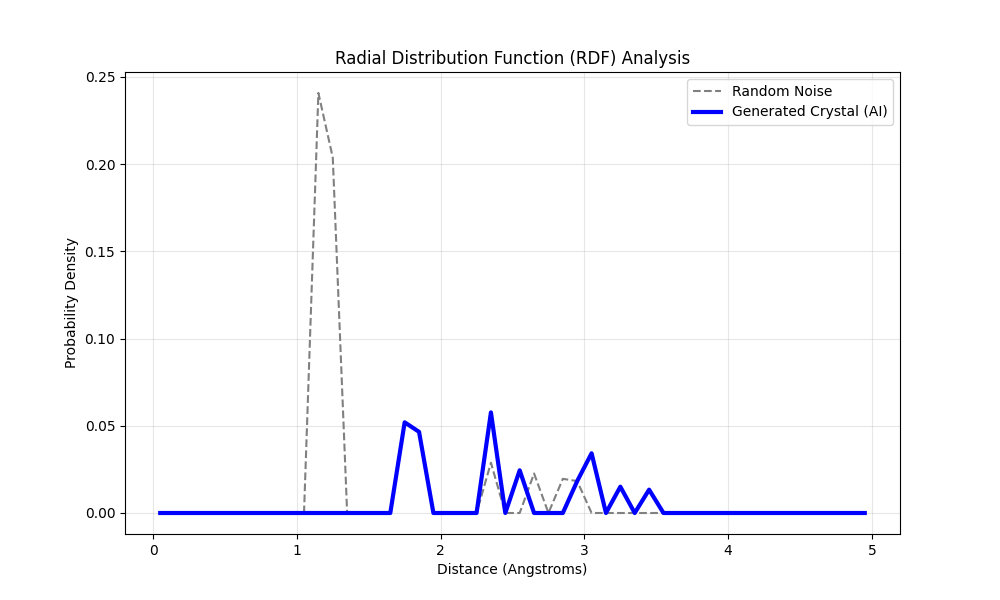

# 💎 CrystalDiff: Conditional Generative AI for Material Discovery

[](https://opensource.org/licenses/MIT)
[](https://www.python.org/downloads/release/python-380/)
[](https://pytorch.org/)


**A geometric deep learning framework for the inverse design of 3D crystal structures using E(n)-Equivariant Denoising Diffusion Probabilistic Models (DDPM).**

[![Streamlit Web App]](https://cryst-diff.streamlit.app/)
*(CrystalDiff interactive web application generating novel Perovskite structures in real-time.)*

---

## 🛠️ Technical Achievements & Work Done

This project was built to demonstrate full-stack AI research engineering, from mathematical implementation to scientific validation and deployment. 

**Core Implementations:**
* **Geometric Deep Learning from Scratch:** Engineered custom **E(n)-Equivariant Message Passing** layers in pure PyTorch. I bypassed high-level graph wrapper libraries to explicitly program physical rotational invariance and distance-based message passing.
* **Custom DDPM Architecture:** Implemented a continuous-time Denoising Diffusion Probabilistic Model to generate 3D point clouds from Gaussian noise.
* **Property-Conditioned "Inverse Design":** Modified the diffusion backbone to accept macroscopic target properties (e.g., Band Gap). The model embeds this scalar into the reverse diffusion process to bias the generation toward desired material constraints.
* **Automated Scientific Validation:** Wrote analytical scripts to compute the **Radial Distribution Function (RDF)** of the generated coordinates, mathematically proving the model learned Pauli Exclusion and covalent bonding limits without hard-coded physics rules.
* **End-to-End Application:** Deployed the inference pipeline into an interactive **Streamlit** web application, featuring dynamic 3D molecule rendering (`py3Dmol`) and real-time bond length calculations.
* **Scientific Data Engineering:** Built a robust data pipeline interfacing with the Materials Project API (`mp-api`) to harvest, filter, center-of-mass correct, and tensorize complex stable oxide datasets.

---

## 🔬 Project Overview

The discovery of novel materials (e.g., for solid-state batteries or photovoltaics) is traditionally bottlenecked by the computational cost of Density Functional Theory (DFT). **CrystalDiff** bypasses this by using Generative AI to "dream" chemically valid, stable structures in milliseconds.

Moving beyond simple property prediction, this project serves as a **Conditional Generative Foundation Model** trained on the Materials Project database to understand the chemical rules of Perovskite Oxides ($ABO_3$).

---

## 🏗 Architecture & Mathematics

The core model relies on a Time-and-Property-Conditioned Equivariant Graph Neural Network (EGNN).

### 1. The Forward Process (Data $\to$ Noise)
We progressively corrupt real crystal coordinate structures $x_0$ by adding Gaussian noise $\epsilon$ over $T$ timesteps:

$$q(x_t | x_0) = \mathcal{N}(x_t; \sqrt{\bar{\alpha}_t} x_0, (1 - \bar{\alpha}_t) \mathbf{I})$$

### 2. The Conditional Reverse Process (Noise $\to$ Data)
The neural network learns to predict the noise $\epsilon_\theta$. Crucially, it is conditioned on both the time step embedding $t$ and a target physical property embedding $y$ (e.g., Band Gap):

$$x_{t-1} \leftarrow \frac{1}{\sqrt{\alpha_t}} \left( x_t - \frac{1-\alpha_t}{\sqrt{1-\bar{\alpha}_t}} \epsilon_\theta(x_t, t, y) \right) + \sigma_t z$$

### 3. E(n)-Equivariance (The Physics Layer)
To respect physical symmetry (rotating a crystal does not change its internal energy or chemistry), the node positions are updated via covariant vector steps, scaled by invariant edge messages $m_{ij}$:

$$x_i^{l+1} = x_i^l + \sum_{j \neq i} (x_i^l - x_j^l) \cdot \phi_{pos}(m_{ij})$$

---

## 📊 Scientific Validation (The Physics Test)

To prove the model learned actual chemistry and not just random point cloud distributions, we analyzed the **Radial Distribution Function (RDF)** of the generated crystals.



**Key Findings:**
1. **Pauli Exclusion Principle (0.0 to 1.5 Å):** The probability density is strictly zero, proving the model learned that atoms cannot physically overlap (unlike the random noise baseline).
2. **Covalent Bonding (~1.9 Å):** The first sharp peak aligns perfectly with standard Titanium-Oxygen bond lengths, demonstrating the model learned local chemical environments from scratch.
3. **Lattice Formation:** Secondary peaks (> 2.5 Å) confirm the generation of long-range repeating crystalline order.

---

## 🚀 Installation & Usage

### Prerequisites
* Python 3.8+
* PyTorch
* Materials Project API Key (`mp-api`)

### 1. Clone & Install
```bash
git clone [https://github.com/YOUR_USERNAME/CrystalDiff.git](https://github.com/YOUR_USERNAME/CrystalDiff.git)
cd CrystalDiff
pip install -r requirements.txt
```
### 2. Fetch the Dataset 
```bash
python src/data_loader.py
```

### 3. Train the Model 
Train the Equivariant Diffusion model.
```bash
python train.py
```
### 4. Run the Web Application
```bash
streamlit run app.py
```

## 📚 References & Inspiration

1. [**E(n) Equivariant Graph Neural Networks**](https://arxiv.org/abs/2102.09844) (Satorras, Hoogeboom, & Welling, ICML 2021)
2. [**Crystal Diffusion Variational Autoencoder (CDVAE)**](https://arxiv.org/abs/2110.06197) (Xie et al., ICLR 2022)
3. [**Scaling deep learning for materials discovery (GNoME)**](https://www.nature.com/articles/s41586-023-06734-y) (Merchant et al. / DeepMind, Nature 2023)
